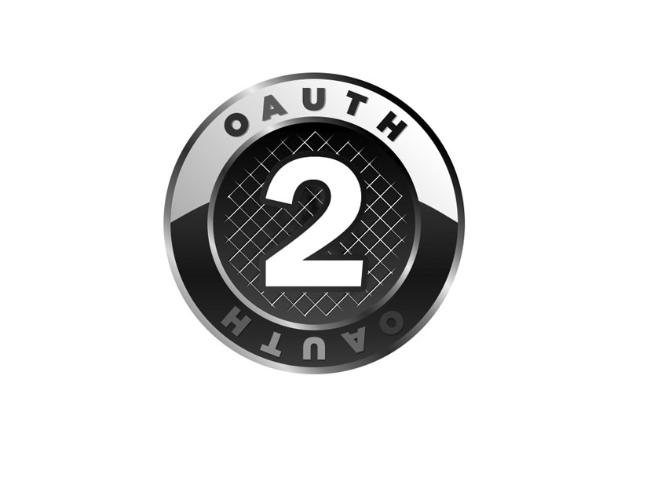

# codingStory

2차 프로젝트 기본설정

프로젝트명 : codingStory

프로그래밍 언어 : JAVA

프레임워크 : Springboot 2.7.11

라이브러리 DI : Spring WEB(MVC), Thymeleaf, Spring Data JPA, Lombok, SpringSecurity5 
               , websocket, validation, OAuth2, security  

데이터베이스 : MySql8

ORM : Spring Data JPA (JAVA(SQL))

개발툴 : IntelliJ

템플릿 엔진 : Thymeleaf (HTML + Data)

빌드 : Gradle

설정 : application.yml, application-oauth2.yml

## DEV

### MEMBER

Security

Oauth2

### attendance

근태

### approval  

##목차 
    -[개요](#개요) 
    -[프로젝트 상세](#프로젝트 상세내용) 

## 개요
사용환경 

프로그램 

[//]: # ()

개발언어 

  

● 프로젝트 개요

2차 프로젝트는 3차 프로젝트의 OPEN API를 연계하여 사용하기 위해 영화관으로 테마를 정했습니다. 
영화관에 근무하는 근무자들이 사용할 수 있는 관리자 페이지를 만들었고, 각종 기능들을 추가하였습니다. 
그 중 저는 근무자들이 보고서를 작성하고 결재를 받는 시스템을 만들었습니다. 

 

프로젝트 상세

# 1. 보고서 문서 작성 후 결재자 설정 
## ● 보고서 작성 페이지

● ↓ 작성자는 보고서 작성시 결재자를 선택할 수 있습니다. 선택할 때 동명이인을 구분하고 가독성을 높이기 위해 부서와 직급, 이름이 모두 보이도록 코드를 작성했습니다. 
    결재자의 정보는 데이터베이스에 저장된 회원들의 정보를 불러와 select option 으로 불러왔습니다.   

  
  
## ● ↓보고서의 종류

    
 
 
 
 
 
 
 
 
 
 
 
 
 
 
 
 

### ADMIN

admin

### FRONT

### department

부서

### pay

급여

### board

notice  공지사항

employee 우수사원

freeBoard 자유게시판

# codingstory
